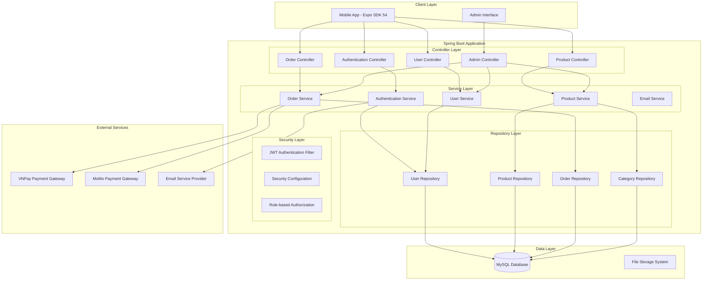

# Design Document

## Overview

The e-commerce backend API is designed as a RESTful Spring Boot application following clean architecture principles. The system provides secure JWT-based authentication, comprehensive product and order management, and role-based access control. The architecture emphasizes separation of concerns, scalability, and maintainability using modern Spring Boot 3.3.x features with Java 22.

## Architecture

### High-Level Architecture



### Technology Stack

- **Framework**: Spring Boot 3.3.x
- **Java Version**: Java 22
- **Database**: MySQL 8.x
- **ORM**: Spring Data JPA with Hibernate
- **Security**: Spring Security with JWT
- **Build Tool**: Maven
- **Code Reduction**: Lombok
- **Validation**: Bean Validation (Hibernate Validator)
- **Logging**: Logback with Lombok @Slf4j
- **Testing**: JUnit 5, Mockito, TestContainers
- **Documentation**: SpringDoc OpenAPI (optional)

## Components and Interfaces

### Controller Layer

#### Authentication Controller
```java
@RestController
@RequestMapping("/api/auth")
@Slf4j
public class AuthController {
    
    @PostMapping("/register")
    public ResponseEntity<AuthResponse> register(@Valid @RequestBody RegisterRequest request);
    
    @PostMapping("/login")
    public ResponseEntity<AuthResponse> login(@Valid @RequestBody LoginRequest request);
    
    @PostMapping("/refresh")
    public ResponseEntity<AuthResponse> refreshToken(@RequestBody RefreshTokenRequest request);
    
    @PostMapping("/forgot-password")
    public ResponseEntity<MessageResponse> forgotPassword(@Valid @RequestBody ForgotPasswordRequest request);
    
    @PostMapping("/reset-password")
    public ResponseEntity<MessageResponse> resetPassword(@Valid @RequestBody ResetPasswordRequest request);
}
```

#### Product Controller
```java
@RestController
@RequestMapping("/api/products")
@Slf4j
public class ProductController {
    
    @GetMapping
    public ResponseEntity<PagedResponse<ProductResponse>> getAllProducts(
        @RequestParam(defaultValue = "0") int page,
        @RequestParam(defaultValue = "20") int size,
        @RequestParam(required = false) String category,
        @RequestParam(required = false) String search
    );
    
    @GetMapping("/{id}")
    public ResponseEntity<ProductDetailResponse> getProductById(@PathVariable Long id);
    
    @GetMapping("/categories")
    public ResponseEntity<List<CategoryResponse>> getAllCategories();
    
    @GetMapping("/search")
    public ResponseEntity<PagedResponse<ProductResponse>> searchProducts(
        @RequestParam String query,
        @RequestParam(defaultValue = "0") int page,
        @RequestParam(defaultValue = "20") int size
    );
}
```

#### Order Controller
```java
@RestController
@RequestMapping("/api/orders")
@Slf4j
public class OrderController {
    
    @PostMapping
    @PreAuthorize("hasRole('USER')")
    public ResponseEntity<OrderResponse> createOrder(@Valid @RequestBody CreateOrderRequest request);
    
    @GetMapping("/my-orders")
    @PreAuthorize("hasRole('USER')")
    public ResponseEntity<PagedResponse<OrderResponse>> getMyOrders(
        @RequestParam(defaultValue = "0") int page,
        @RequestParam(defaultValue = "10") int size
    );
    
    @GetMapping("/{id}")
    @PreAuthorize("hasRole('USER')")
    public ResponseEntity<OrderDetailResponse> getOrderById(@PathVariable Long id);
    
    @PostMapping("/{id}/cancel")
    @PreAuthorize("hasRole('USER')")
    public ResponseEntity<MessageResponse> cancelOrder(@PathVariable Long id);
}
```

#### Admin Controller
```java
@RestController
@RequestMapping("/api/admin")
@PreAuthorize("hasRole('ADMIN')")
@Slf4j
public class AdminController {
    
    // Product Management
    @PostMapping("/products")
    public ResponseEntity<ProductResponse> createProduct(@Valid @RequestBody CreateProductRequest request);
    
    @PutMapping("/products/{id}")
    public ResponseEntity<ProductResponse> updateProduct(@PathVariable Long id, @Valid @RequestBody UpdateProductRequest request);
    
    @DeleteMapping("/products/{id}")
    public ResponseEntity<MessageResponse> deleteProduct(@PathVariable Long id);
    
    // Order Management
    @GetMapping("/orders")
    public ResponseEntity<PagedResponse<OrderResponse>> getAllOrders(
        @RequestParam(defaultValue = "0") int page,
        @RequestParam(defaultValue = "20") int size,
        @RequestParam(required = false) String status
    );
    
    @PutMapping("/orders/{id}/status")
    public ResponseEntity<OrderResponse> updateOrderStatus(@PathVariable Long id, @Valid @RequestBody UpdateOrderStatusRequest request);
    
    // User Management
    @GetMapping("/users")
    public ResponseEntity<PagedResponse<UserResponse>> getAllUsers(
        @RequestParam(defaultValue = "0") int page,
        @RequestParam(defaultValue = "20") int size
    );
    
    @PutMapping("/users/{id}/status")
    public ResponseEntity<UserResponse> updateUserStatus(@PathVariable Long id, @Valid @RequestBody UpdateUserStatusRequest request);
    
    // Dashboard Analytics
    @GetMapping("/dashboard")
    public ResponseEntity<DashboardResponse> getDashboardMetrics();
}
```

### Service Layer

#### Authentication Service Interface
```java
public interface AuthService {
    AuthResponse register(RegisterRequest request);
    AuthResponse login(LoginRequest request);
    AuthResponse refreshToken(String refreshToken);
    void forgotPassword(String email);
    void resetPassword(String token, String newPassword);
    UserDetails loadUserByUsername(String username);
}
```

#### Product Service Interface
```java
public interface ProductService {
    PagedResponse<ProductResponse> getAllProducts(int page, int size, String category, String search);
    ProductDetailResponse getProductById(Long id);
    List<CategoryResponse> getAllCategories();
    PagedResponse<ProductResponse> searchProducts(String query, int page, int size);
    
    // Admin methods
    ProductResponse createProduct(CreateProductRequest request);
    ProductResponse updateProduct(Long id, UpdateProductRequest request);
    void deleteProduct(Long id);
    ProductResponse updateProductInventory(Long id, UpdateInventoryRequest request);
}
```

#### Order Service Interface
```java
public interface OrderService {
    OrderResponse createOrder(CreateOrderRequest request, String userEmail);
    PagedResponse<OrderResponse> getUserOrders(String userEmail, int page, int size);
    OrderDetailResponse getOrderById(Long id, String userEmail);
    void cancelOrder(Long id, String userEmail);
    
    // Admin methods
    PagedResponse<OrderResponse> getAllOrders(int page, int size, String status);
    OrderResponse updateOrderStatus(Long id, OrderStatus status);
    DashboardMetrics calculateDashboardMetrics();
}
```

## Data Models

### JPA Entity Models

#### User Entity
```java
@Entity
@Table(name = "users")
@Data
@NoArgsConstructor
@AllArgsConstructor
@Builder
public class User {
    @Id
    @GeneratedValue(strategy = GenerationType.IDENTITY)
    private Long id;
    
    @Column(unique = true, nullable = false)
    @Email
    private String email;
    
    @Column(nullable = false)
    private String password;
    
    @Column(name = "first_name", nullable = false)
    private String firstName;
    
    @Column(name = "last_name", nullable = false)
    private String lastName;
    
    private String phone;
    
    @Embedded
    private Address address;
    
    @Enumerated(EnumType.STRING)
    @Builder.Default
    private Role role = Role.USER;
    
    @Builder.Default
    private Boolean isActive = true;
    
    @CreationTimestamp
    private LocalDateTime createdAt;
    
    @UpdateTimestamp
    private LocalDateTime updatedAt;
    
    @OneToMany(mappedBy = "user", cascade = CascadeType.ALL)
    private List<Order> orders = new ArrayList<>();
}

@Embeddable
@Data
@NoArgsConstructor
@AllArgsConstructor
public class Address {
    private String street;
    private String city;
    private String state;
    private String zipCode;
    private String country;
}

public enum Role {
    USER, ADMIN
}
```

#### Product Entity
```java
@Entity
@Table(name = "products")
@Data
@NoArgsConstructor
@AllArgsConstructor
@Builder
public class Product {
    @Id
    @GeneratedValue(strategy = GenerationType.IDENTITY)
    private Long id;
    
    @Column(nullable = false)
    private String name;
    
    @Column(columnDefinition = "TEXT")
    private String description;
    
    @Column(nullable = false, precision = 10, scale = 2)
    private BigDecimal price;
    
    @ElementCollection
    @CollectionTable(name = "product_images", joinColumns = @JoinColumn(name = "product_id"))
    @Column(name = "image_url")
    private List<String> images = new ArrayList<>();
    
    @ManyToOne(fetch = FetchType.LAZY)
    @JoinColumn(name = "category_id")
    private Category category;
    
    @OneToMany(mappedBy = "product", cascade = CascadeType.ALL, orphanRemoval = true)
    private List<ProductVariant> variants = new ArrayList<>();
    
    @Builder.Default
    private Boolean isActive = true;
    
    @CreationTimestamp
    private LocalDateTime createdAt;
    
    @UpdateTimestamp
    private LocalDateTime updatedAt;
}

@Entity
@Table(name = "categories")
@Data
@NoArgsConstructor
@AllArgsConstructor
@Builder
public class Category {
    @Id
    @GeneratedValue(strategy = GenerationType.IDENTITY)
    private Long id;
    
    @Column(unique = true, nullable = false)
    private String name;
    
    private String description;
    
    @ManyToOne(fetch = FetchType.LAZY)
    @JoinColumn(name = "parent_id")
    private Category parent;
    
    @OneToMany(mappedBy = "parent", cascade = CascadeType.ALL)
    private List<Category> children = new ArrayList<>();
    
    @OneToMany(mappedBy = "category")
    private List<Product> products = new ArrayList<>();
}

@Entity
@Table(name = "product_variants")
@Data
@NoArgsConstructor
@AllArgsConstructor
@Builder
public class ProductVariant {
    @Id
    @GeneratedValue(strategy = GenerationType.IDENTITY)
    private Long id;
    
    @ManyToOne(fetch = FetchType.LAZY)
    @JoinColumn(name = "product_id")
    private Product product;
    
    private String size;
    private String color;
    private String colorHex;
    
    @Builder.Default
    private Integer quantity = 0;
    
    @Column(precision = 10, scale = 2)
    private BigDecimal additionalPrice;
}
```

#### Order Entity
```java
@Entity
@Table(name = "orders")
@Data
@NoArgsConstructor
@AllArgsConstructor
@Builder
public class Order {
    @Id
    @GeneratedValue(strategy = GenerationType.IDENTITY)
    private Long id;
    
    @ManyToOne(fetch = FetchType.LAZY)
    @JoinColumn(name = "user_id")
    private User user;
    
    @OneToMany(mappedBy = "order", cascade = CascadeType.ALL, orphanRemoval = true)
    private List<OrderItem> items = new ArrayList<>();
    
    @Embedded
    @AttributeOverrides({
        @AttributeOverride(name = "street", column = @Column(name = "shipping_street")),
        @AttributeOverride(name = "city", column = @Column(name = "shipping_city")),
        @AttributeOverride(name = "state", column = @Column(name = "shipping_state")),
        @AttributeOverride(name = "zipCode", column = @Column(name = "shipping_zip_code")),
        @AttributeOverride(name = "country", column = @Column(name = "shipping_country"))
    })
    private Address shippingAddress;
    
    @Enumerated(EnumType.STRING)
    private PaymentMethod paymentMethod;
    
    @Enumerated(EnumType.STRING)
    @Builder.Default
    private OrderStatus status = OrderStatus.PENDING;
    
    @Column(precision = 10, scale = 2)
    private BigDecimal subtotal;
    
    @Column(precision = 10, scale = 2)
    private BigDecimal tax;
    
    @Column(precision = 10, scale = 2)
    private BigDecimal shipping;
    
    @Column(precision = 10, scale = 2)
    private BigDecimal total;
    
    @CreationTimestamp
    private LocalDateTime createdAt;
    
    @UpdateTimestamp
    private LocalDateTime updatedAt;
}

@Entity
@Table(name = "order_items")
@Data
@NoArgsConstructor
@AllArgsConstructor
@Builder
public class OrderItem {
    @Id
    @GeneratedValue(strategy = GenerationType.IDENTITY)
    private Long id;
    
    @ManyToOne(fetch = FetchType.LAZY)
    @JoinColumn(name = "order_id")
    private Order order;
    
    @ManyToOne(fetch = FetchType.LAZY)
    @JoinColumn(name = "product_id")
    private Product product;
    
    @ManyToOne(fetch = FetchType.LAZY)
    @JoinColumn(name = "variant_id")
    private ProductVariant variant;
    
    private Integer quantity;
    
    @Column(precision = 10, scale = 2)
    private BigDecimal unitPrice;
    
    @Column(precision = 10, scale = 2)
    private BigDecimal totalPrice;
}

public enum OrderStatus {
    PENDING, PROCESSING, SHIPPED, DELIVERED, CANCELLED
}

public enum PaymentMethod {
    VNPAY, MOMO, COD
}
```

## Error Handling

### Global Exception Handler

```java
@RestControllerAdvice
@Slf4j
public class GlobalExceptionHandler {
    
    @ExceptionHandler(ValidationException.class)
    public ResponseEntity<ErrorResponse> handleValidation(ValidationException ex) {
        log.warn("Validation error: {}", ex.getMessage());
        return ResponseEntity.badRequest()
            .body(ErrorResponse.builder()
                .error("VALIDATION_ERROR")
                .message(ex.getMessage())
                .timestamp(LocalDateTime.now())
                .build());
    }
    
    @ExceptionHandler(ResourceNotFoundException.class)
    public ResponseEntity<ErrorResponse> handleResourceNotFound(ResourceNotFoundException ex) {
        log.warn("Resource not found: {}", ex.getMessage());
        return ResponseEntity.status(HttpStatus.NOT_FOUND)
            .body(ErrorResponse.builder()
                .error("RESOURCE_NOT_FOUND")
                .message(ex.getMessage())
                .timestamp(LocalDateTime.now())
                .build());
    }
    
    @ExceptionHandler(UnauthorizedException.class)
    public ResponseEntity<ErrorResponse> handleUnauthorized(UnauthorizedException ex) {
        log.warn("Unauthorized access: {}", ex.getMessage());
        return ResponseEntity.status(HttpStatus.UNAUTHORIZED)
            .body(ErrorResponse.builder()
                .error("UNAUTHORIZED")
                .message(ex.getMessage())
                .timestamp(LocalDateTime.now())
                .build());
    }
    
    @ExceptionHandler(AccessDeniedException.class)
    public ResponseEntity<ErrorResponse> handleAccessDenied(AccessDeniedException ex) {
        log.warn("Access denied: {}", ex.getMessage());
        return ResponseEntity.status(HttpStatus.FORBIDDEN)
            .body(ErrorResponse.builder()
                .error("ACCESS_DENIED")
                .message("You don't have permission to access this resource")
                .timestamp(LocalDateTime.now())
                .build());
    }
    
    @ExceptionHandler(Exception.class)
    public ResponseEntity<ErrorResponse> handleGeneral(Exception ex) {
        log.error("Unexpected error occurred", ex);
        return ResponseEntity.status(HttpStatus.INTERNAL_SERVER_ERROR)
            .body(ErrorResponse.builder()
                .error("INTERNAL_SERVER_ERROR")
                .message("An unexpected error occurred")
                .timestamp(LocalDateTime.now())
                .build());
    }
}
```

### Custom Exception Classes

```java
public class ResourceNotFoundException extends RuntimeException {
    public ResourceNotFoundException(String message) {
        super(message);
    }
}

public class UnauthorizedException extends RuntimeException {
    public UnauthorizedException(String message) {
        super(message);
    }
}

public class ValidationException extends RuntimeException {
    public ValidationException(String message) {
        super(message);
    }
}
```

## Testing Strategy

### Testing Approach

#### Unit Testing
- **Service Layer Testing**: Test business logic in isolation using Mockito for dependencies
- **Repository Testing**: Use @DataJpaTest for testing JPA repositories with H2 in-memory database
- **Controller Testing**: Use @WebMvcTest for testing REST endpoints with mocked services
- **Security Testing**: Test JWT authentication and authorization logic

#### Integration Testing
- **API Integration**: Test complete request/response cycles using @SpringBootTest
- **Database Integration**: Use TestContainers with MySQL for realistic database testing
- **Security Integration**: Test authentication flows and role-based access control
- **External Service Integration**: Mock external payment gateways and email services

#### Test Configuration

```java
@TestConfiguration
public class TestConfig {
    
    @Bean
    @Primary
    public Clock testClock() {
        return Clock.fixed(Instant.parse("2024-01-01T00:00:00Z"), ZoneOffset.UTC);
    }
    
    @Bean
    @Primary
    public PasswordEncoder testPasswordEncoder() {
        return new BCryptPasswordEncoder(4); // Faster for tests
    }
}

@Testcontainers
@SpringBootTest(webEnvironment = SpringBootTest.WebEnvironment.RANDOM_PORT)
class IntegrationTestBase {
    
    @Container
    static MySQLContainer<?> mysql = new MySQLContainer<>("mysql:8.0")
            .withDatabaseName("testdb")
            .withUsername("test")
            .withPassword("test");
    
    @DynamicPropertySource
    static void configureProperties(DynamicPropertyRegistry registry) {
        registry.add("spring.datasource.url", mysql::getJdbcUrl);
        registry.add("spring.datasource.username", mysql::getUsername);
        registry.add("spring.datasource.password", mysql::getPassword);
    }
}
```

### Security Configuration

```java
@Configuration
@EnableWebSecurity
@EnableMethodSecurity
@RequiredArgsConstructor
@Slf4j
public class SecurityConfig {
    
    private final JwtAuthenticationEntryPoint jwtAuthenticationEntryPoint;
    private final JwtRequestFilter jwtRequestFilter;
    
    @Bean
    public PasswordEncoder passwordEncoder() {
        return new BCryptPasswordEncoder();
    }
    
    @Bean
    public AuthenticationManager authenticationManager(AuthenticationConfiguration config) throws Exception {
        return config.getAuthenticationManager();
    }
    
    @Bean
    public SecurityFilterChain filterChain(HttpSecurity http) throws Exception {
        http.csrf(csrf -> csrf.disable())
            .cors(cors -> cors.configurationSource(corsConfigurationSource()))
            .authorizeHttpRequests(auth -> auth
                .requestMatchers("/api/auth/**").permitAll()
                .requestMatchers(HttpMethod.GET, "/api/products/**").permitAll()
                .requestMatchers("/api/admin/**").hasRole("ADMIN")
                .requestMatchers("/api/orders/**").hasRole("USER")
                .requestMatchers("/api/users/profile/**").hasRole("USER")
                .anyRequest().authenticated()
            )
            .exceptionHandling(ex -> ex.authenticationEntryPoint(jwtAuthenticationEntryPoint))
            .sessionManagement(session -> session.sessionCreationPolicy(SessionCreationPolicy.STATELESS));
        
        http.addFilterBefore(jwtRequestFilter, UsernamePasswordAuthenticationFilter.class);
        
        return http.build();
    }
    
    @Bean
    public CorsConfigurationSource corsConfigurationSource() {
        CorsConfiguration configuration = new CorsConfiguration();
        configuration.setAllowedOriginPatterns(Arrays.asList("*"));
        configuration.setAllowedMethods(Arrays.asList("GET", "POST", "PUT", "DELETE", "OPTIONS"));
        configuration.setAllowedHeaders(Arrays.asList("*"));
        configuration.setAllowCredentials(true);
        
        UrlBasedCorsConfigurationSource source = new UrlBasedCorsConfigurationSource();
        source.registerCorsConfiguration("/api/**", configuration);
        return source;
    }
}
```

### JWT Implementation

```java
@Component
@Slf4j
public class JwtUtil {
    
    @Value("${jwt.secret}")
    private String secret;
    
    @Value("${jwt.expiration}")
    private Long expiration;
    
    public String generateToken(UserDetails userDetails) {
        Map<String, Object> claims = new HashMap<>();
        claims.put("role", userDetails.getAuthorities().iterator().next().getAuthority());
        return createToken(claims, userDetails.getUsername());
    }
    
    private String createToken(Map<String, Object> claims, String subject) {
        return Jwts.builder()
                .setClaims(claims)
                .setSubject(subject)
                .setIssuedAt(new Date(System.currentTimeMillis()))
                .setExpiration(new Date(System.currentTimeMillis() + expiration))
                .signWith(SignatureAlgorithm.HS512, secret)
                .compact();
    }
    
    public Boolean validateToken(String token, UserDetails userDetails) {
        final String username = getUsernameFromToken(token);
        return (username.equals(userDetails.getUsername()) && !isTokenExpired(token));
    }
    
    public String getUsernameFromToken(String token) {
        return getClaimFromToken(token, Claims::getSubject);
    }
    
    public Date getExpirationDateFromToken(String token) {
        return getClaimFromToken(token, Claims::getExpiration);
    }
    
    public <T> T getClaimFromToken(String token, Function<Claims, T> claimsResolver) {
        final Claims claims = getAllClaimsFromToken(token);
        return claimsResolver.apply(claims);
    }
    
    private Claims getAllClaimsFromToken(String token) {
        return Jwts.parser().setSigningKey(secret).parseClaimsJws(token).getBody();
    }
    
    private Boolean isTokenExpired(String token) {
        final Date expiration = getExpirationDateFromToken(token);
        return expiration.before(new Date());
    }
}
```

This design provides a comprehensive, scalable Spring Boot backend that meets all the requirements specified in your Vietnamese document, with proper separation of concerns, security, and modern Java practices.