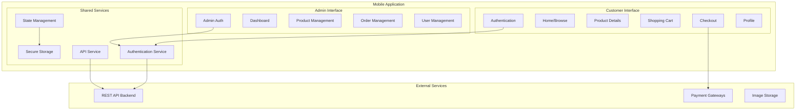

# Design Document

## Overview

The e-commerce clothing application is designed as a dual-interface mobile application using Expo Go SDK 54. The architecture separates customer and administrative functionality through distinct routing layouts while sharing common services and components. The design emphasizes modern fashion aesthetics, cross-platform compatibility, and scalable state management.

## Architecture

### High-Level Architecture



### Technology Stack

- **Framework**: React Native with Expo SDK 54
- **Routing**: expo-router with multi-layout support
- **UI Library**: NativeBase for consistent component design
- **State Management**: Zustand for lightweight, scalable state
- **Authentication Storage**: expo-secure-store for JWT token management
- **HTTP Client**: Axios for API communication
- **Safe Area**: react-native-safe-area-context
- **Image Handling**: expo-image-picker
- **Icons**: @expo/vector-icons
- **Animations**: react-native-reanimated

## Components and Interfaces

### Core Components

#### Authentication Components
- **LoginForm**: Handles user credential input and validation
- **RegisterForm**: Manages new user registration with form validation
- **AuthGuard**: Protects routes requiring authentication
- **RoleGuard**: Separates customer and admin access

#### Customer Interface Components
- **ProductCard**: Displays product preview with image, name, and price
- **ProductGrid**: Grid layout for product listings
- **SearchBar**: Product search functionality with real-time filtering
- **CartItem**: Individual cart item with quantity controls
- **CheckoutForm**: Address and payment method selection
- **OrderHistoryItem**: Displays past order information

#### Admin Interface Components
- **DashboardCard**: Metric display cards for analytics
- **ProductForm**: Create/edit product form with image upload
- **OrderStatusPicker**: Dropdown for order status updates
- **UserListItem**: Customer account display with action buttons
- **CategoryManager**: CRUD interface for product categories

#### Shared Components
- **SafeAreaWrapper**: Consistent safe area implementation
- **LoadingSpinner**: Unified loading indicator
- **ErrorBoundary**: Error handling and display
- **ImageUploader**: Reusable image selection and upload
- **ConfirmationModal**: Action confirmation dialogs

### Service Interfaces

#### AuthService Interface
```typescript
interface AuthService {
  login(credentials: LoginCredentials): Promise<AuthResponse>
  register(userData: RegisterData): Promise<AuthResponse>
  logout(): Promise<void>
  getCurrentUser(): Promise<User | null>
  refreshToken(): Promise<string>
  isAuthenticated(): boolean
}
```

#### APIService Interface
```typescript
interface APIService {
  get<T>(endpoint: string, params?: object): Promise<T>
  post<T>(endpoint: string, data: object): Promise<T>
  put<T>(endpoint: string, data: object): Promise<T>
  delete<T>(endpoint: string): Promise<T>
  uploadImage(file: File): Promise<string>
}
```

#### StateStore Interface
```typescript
interface AppState {
  // Auth State
  user: User | null
  isAuthenticated: boolean
  
  // Product State
  products: Product[]
  categories: Category[]
  currentProduct: Product | null
  
  // Cart State
  cartItems: CartItem[]
  cartTotal: number
  
  // Order State
  orders: Order[]
  currentOrder: Order | null
  
  // Admin State
  dashboardMetrics: DashboardData
  allOrders: Order[]
  allUsers: User[]
}
```

## Data Models

### Core Data Models

#### User Model
```typescript
interface User {
  id: string
  email: string
  firstName: string
  lastName: string
  phone?: string
  address?: Address
  role: 'customer' | 'admin'
  isActive: boolean
  createdAt: Date
  updatedAt: Date
}

interface Address {
  street: string
  city: string
  state: string
  zipCode: string
  country: string
}
```

#### Product Model
```typescript
interface Product {
  id: string
  name: string
  description: string
  price: number
  images: string[]
  category: Category
  sizes: Size[]
  colors: Color[]
  inventory: InventoryItem[]
  isActive: boolean
  createdAt: Date
  updatedAt: Date
}

interface Category {
  id: string
  name: string
  description?: string
  parentId?: string
}

interface Size {
  id: string
  name: string
  value: string
}

interface Color {
  id: string
  name: string
  hexCode: string
}

interface InventoryItem {
  sizeId: string
  colorId: string
  quantity: number
}
```

#### Order Model
```typescript
interface Order {
  id: string
  userId: string
  items: OrderItem[]
  shippingAddress: Address
  paymentMethod: PaymentMethod
  status: OrderStatus
  subtotal: number
  tax: number
  shipping: number
  total: number
  createdAt: Date
  updatedAt: Date
}

interface OrderItem {
  productId: string
  sizeId: string
  colorId: string
  quantity: number
  unitPrice: number
  totalPrice: number
}

type OrderStatus = 'pending' | 'processing' | 'shipped' | 'delivered' | 'cancelled'
type PaymentMethod = 'vnpay' | 'momo' | 'cod'
```

#### Cart Model
```typescript
interface CartItem {
  productId: string
  product: Product
  sizeId: string
  colorId: string
  quantity: number
  addedAt: Date
}
```

## Error Handling

### Error Types and Handling Strategy

#### Network Errors
- **Connection Timeout**: Display retry mechanism with exponential backoff
- **Server Errors (5xx)**: Show generic error message with retry option
- **Client Errors (4xx)**: Display specific error messages based on response

#### Authentication Errors
- **Invalid Credentials**: Clear error message on login form
- **Token Expiration**: Automatic token refresh or redirect to login
- **Unauthorized Access**: Redirect to appropriate login screen

#### Validation Errors
- **Form Validation**: Real-time field validation with clear error messages
- **Business Logic Errors**: Display contextual error messages
- **Data Integrity**: Prevent invalid state transitions

#### Error Boundary Implementation
```typescript
interface ErrorBoundaryState {
  hasError: boolean
  error: Error | null
  errorInfo: ErrorInfo | null
}

class AppErrorBoundary extends Component<Props, ErrorBoundaryState> {
  // Catch JavaScript errors anywhere in child component tree
  // Log error details and display fallback UI
  // Provide recovery mechanisms where appropriate
}
```

## Testing Strategy

### Testing Approach

#### Unit Testing
- **Component Testing**: Test individual components in isolation using React Native Testing Library
- **Service Testing**: Test API services, authentication logic, and state management
- **Utility Testing**: Test helper functions, validators, and formatters
- **Hook Testing**: Test custom React hooks for state management and side effects

#### Integration Testing
- **API Integration**: Test service layer integration with backend APIs
- **Navigation Testing**: Test routing and navigation flows between screens
- **State Integration**: Test state management integration across components
- **Authentication Flow**: Test complete authentication workflows

#### End-to-End Testing
- **Customer Journey**: Test complete shopping flow from browse to purchase
- **Admin Workflows**: Test product management and order processing flows
- **Cross-Platform**: Test critical paths on both iOS and Android simulators

#### Performance Testing
- **Load Testing**: Test app performance with large product catalogs
- **Memory Testing**: Monitor memory usage during navigation and state changes
- **Animation Performance**: Ensure smooth animations on lower-end devices

### Testing Tools and Configuration

- **Unit/Integration**: Jest with React Native Testing Library
- **E2E Testing**: Detox for React Native end-to-end testing
- **Performance**: Flipper for debugging and performance monitoring
- **Code Coverage**: Istanbul for coverage reporting
- **Mocking**: MSW (Mock Service Worker) for API mocking during tests

### Test Data Management

- **Mock Data**: Comprehensive mock data sets for products, users, and orders
- **Test Fixtures**: Reusable test data fixtures for consistent testing
- **Environment Separation**: Separate test environment with isolated data
- **Seed Data**: Automated test data seeding for consistent test runs

## UI/UX Design Specifications

### Design System

#### Color Palette
- **Primary**: Black (#000000) for headers and primary actions
- **Secondary**: White (#FFFFFF) for backgrounds and contrast
- **Accent**: Soft pastels (#F5F5F5, #E8E8E8) for subtle highlights
- **Success**: Muted green (#4A5D23) for confirmations
- **Error**: Soft red (#D32F2F) for errors and warnings
- **Text**: Charcoal (#333333) for body text

#### Typography
- **Primary Font**: Poppins for headings and important text
- **Secondary Font**: Inter for body text and descriptions
- **Font Sizes**: 
  - Heading 1: 28px (bold)
  - Heading 2: 24px (semibold)
  - Heading 3: 20px (medium)
  - Body: 16px (regular)
  - Caption: 14px (regular)
  - Small: 12px (regular)

#### Spacing System
- **Base Unit**: 8px
- **Spacing Scale**: 4px, 8px, 16px, 24px, 32px, 48px, 64px
- **Component Padding**: 16px standard, 24px for containers
- **Element Margins**: 8px between related elements, 16px between sections

#### Component Specifications

##### Buttons
- **Primary Button**: Black background, white text, 48px height, 16px padding
- **Secondary Button**: White background, black border, black text
- **Text Button**: No background, underlined text for links
- **Minimum Touch Target**: 44px x 44px for accessibility

##### Cards
- **Product Card**: White background, subtle shadow, 8px border radius
- **Content Padding**: 16px internal padding
- **Image Aspect Ratio**: 4:5 for product images
- **Card Spacing**: 16px between cards in grid

##### Forms
- **Input Fields**: 48px height, 16px padding, subtle border
- **Focus State**: Black border, no shadow
- **Error State**: Red border with error message below
- **Label Positioning**: Above input field with 8px spacing

### Animation and Interactions

#### Page Transitions
- **Screen Transitions**: Slide animations using react-native-reanimated
- **Duration**: 300ms for screen transitions
- **Easing**: Ease-out for natural feel

#### Micro-interactions
- **Button Press**: Subtle scale animation (0.95x) with haptic feedback
- **Loading States**: Skeleton screens for content loading
- **Pull-to-Refresh**: Custom refresh indicator with brand colors
- **Add to Cart**: Success animation with cart icon bounce

#### Responsive Behavior
- **Breakpoints**: Optimize for phone (320-768px) and tablet (768px+)
- **Grid Adaptation**: 2 columns on phone, 3-4 columns on tablet
- **Navigation**: Bottom tabs on phone, side navigation on tablet
- **Safe Area**: Consistent safe area handling across all devices