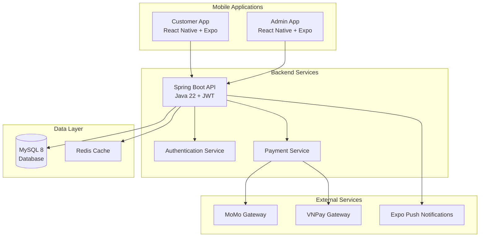
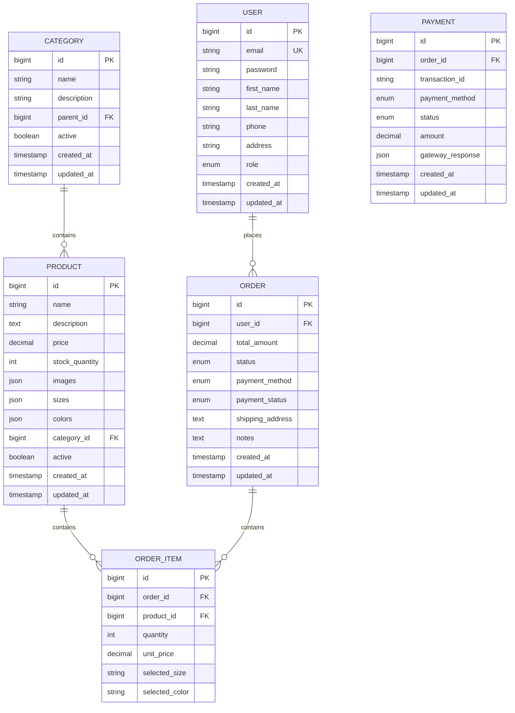

# Design Document

## Overview

The full-stack e-commerce platform follows a microservices-inspired architecture with three main applications: a Spring Boot backend API, a React Native customer mobile app, and a React Native admin mobile app. The system uses JWT-based authentication, supports multiple payment gateways, and provides comprehensive e-commerce functionality.

## Architecture

### High-Level Architecture



### Technology Stack

**Backend (Spring Boot)**
- Java 22 with Spring Boot 3.x
- Spring Security + JWT for authentication
- Spring Data JPA for database operations
- MySQL 8 for primary database
- Redis for caching and session management
- Swagger/OpenAPI for documentation
- Maven for dependency management

**Customer App (React Native + Expo)**
- Expo SDK 49+
- React Navigation 6 for routing
- Redux Toolkit for state management
- Axios for API communication
- Expo SecureStore for token storage
- Expo Notifications for push notifications
- Native Base for UI components
- React Native Paper for additional UI elements

**Admin App (React Native + Expo)**
- Expo SDK 49+
- React Navigation 6 for routing
- Zustand for lightweight state management
- Axios for API communication
- Victory Native for charts and analytics
- Native Base for UI components
- Expo SecureStore for secure storage

## Components and Interfaces

### Backend API Structure

```
backend/
├── src/main/java/com/ecommerce/
│   ├── config/
│   │   ├── SecurityConfig.java
│   │   ├── JwtConfig.java
│   │   └── SwaggerConfig.java
│   ├── controller/
│   │   ├── AuthController.java
│   │   ├── ProductController.java
│   │   ├── CategoryController.java
│   │   ├── OrderController.java
│   │   ├── UserController.java
│   │   ├── PaymentController.java
│   │   └── StatisticsController.java
│   ├── dto/
│   │   ├── request/
│   │   └── response/
│   ├── entity/
│   │   ├── User.java
│   │   ├── Product.java
│   │   ├── Category.java
│   │   ├── Order.java
│   │   ├── OrderItem.java
│   │   └── Payment.java
│   ├── repository/
│   ├── service/
│   │   ├── AuthService.java
│   │   ├── ProductService.java
│   │   ├── OrderService.java
│   │   ├── PaymentService.java
│   │   └── StatisticsService.java
│   ├── security/
│   │   ├── JwtAuthenticationFilter.java
│   │   ├── JwtTokenProvider.java
│   │   └── UserDetailsServiceImpl.java
│   └── util/
└── src/main/resources/
    ├── application.yml
    └── db/migration/
```

### Key API Endpoints

**Authentication Endpoints**
```
POST /api/auth/register
POST /api/auth/login
POST /api/auth/refresh
POST /api/auth/logout
```

**Product Management**
```
GET /api/products
GET /api/products/{id}
POST /api/products (Admin only)
PUT /api/products/{id} (Admin only)
DELETE /api/products/{id} (Admin only)
GET /api/products/search?q={keyword}
GET /api/products/category/{categoryId}
```

**Order Management**
```
GET /api/orders (User: own orders, Admin: all orders)
GET /api/orders/{id}
POST /api/orders
PUT /api/orders/{id}/status (Admin only)
```

**Payment Processing**
```
POST /api/payment/momo
POST /api/payment/vnpay
POST /api/payment/cod
GET /api/payment/{orderId}/status
```

### Mobile App Architecture

**Customer App Structure**
```
customer/
├── src/
│   ├── components/
│   │   ├── common/
│   │   ├── product/
│   │   ├── cart/
│   │   └── order/
│   ├── screens/
│   │   ├── auth/
│   │   ├── home/
│   │   ├── product/
│   │   ├── cart/
│   │   ├── order/
│   │   └── profile/
│   ├── navigation/
│   ├── store/
│   │   ├── slices/
│   │   └── api/
│   ├── services/
│   ├── utils/
│   └── constants/
├── assets/
└── app.json
```

**Admin App Structure**
```
admin/
├── src/
│   ├── components/
│   │   ├── common/
│   │   ├── dashboard/
│   │   ├── management/
│   │   └── charts/
│   ├── screens/
│   │   ├── auth/
│   │   ├── dashboard/
│   │   ├── products/
│   │   ├── orders/
│   │   ├── users/
│   │   └── statistics/
│   ├── navigation/
│   ├── store/
│   ├── services/
│   └── utils/
├── assets/
└── app.json
```

## Data Models

### Core Entities

**User Entity**
```java
@Entity
public class User {
    @Id
    @GeneratedValue(strategy = GenerationType.IDENTITY)
    private Long id;
    
    @Column(unique = true, nullable = false)
    private String email;
    
    @Column(nullable = false)
    private String password;
    
    private String firstName;
    private String lastName;
    private String phone;
    private String address;
    
    @Enumerated(EnumType.STRING)
    private Role role; // ROLE_USER, ROLE_ADMIN
    
    @CreationTimestamp
    private LocalDateTime createdAt;
    
    @UpdateTimestamp
    private LocalDateTime updatedAt;
}
```

**Product Entity**
```java
@Entity
public class Product {
    @Id
    @GeneratedValue(strategy = GenerationType.IDENTITY)
    private Long id;
    
    @Column(nullable = false)
    private String name;
    
    @Column(length = 1000)
    private String description;
    
    @Column(nullable = false)
    private BigDecimal price;
    
    private Integer stockQuantity;
    
    @ElementCollection
    private List<String> images;
    
    @ElementCollection
    private List<String> sizes;
    
    @ElementCollection
    private List<String> colors;
    
    @ManyToOne
    @JoinColumn(name = "category_id")
    private Category category;
    
    private Boolean active = true;
    
    @CreationTimestamp
    private LocalDateTime createdAt;
    
    @UpdateTimestamp
    private LocalDateTime updatedAt;
}
```

**Order Entity**
```java
@Entity
@Table(name = "orders")
public class Order {
    @Id
    @GeneratedValue(strategy = GenerationType.IDENTITY)
    private Long id;
    
    @ManyToOne
    @JoinColumn(name = "user_id", nullable = false)
    private User user;
    
    @OneToMany(mappedBy = "order", cascade = CascadeType.ALL)
    private List<OrderItem> orderItems;
    
    @Column(nullable = false)
    private BigDecimal totalAmount;
    
    @Enumerated(EnumType.STRING)
    private OrderStatus status; // PENDING, CONFIRMED, SHIPPED, COMPLETED, CANCELED
    
    @Enumerated(EnumType.STRING)
    private PaymentMethod paymentMethod; // COD, MOMO, VNPAY
    
    @Enumerated(EnumType.STRING)
    private PaymentStatus paymentStatus; // PENDING, PAID, FAILED
    
    private String shippingAddress;
    private String notes;
    
    @CreationTimestamp
    private LocalDateTime createdAt;
    
    @UpdateTimestamp
    private LocalDateTime updatedAt;
}
```

### Database Schema Design



## Error Handling

### Backend Error Handling Strategy

**Global Exception Handler**
```java
@RestControllerAdvice
public class GlobalExceptionHandler {
    
    @ExceptionHandler(ValidationException.class)
    public ResponseEntity<ErrorResponse> handleValidation(ValidationException ex) {
        return ResponseEntity.badRequest()
            .body(new ErrorResponse("VALIDATION_ERROR", ex.getMessage()));
    }
    
    @ExceptionHandler(ResourceNotFoundException.class)
    public ResponseEntity<ErrorResponse> handleNotFound(ResourceNotFoundException ex) {
        return ResponseEntity.notFound()
            .body(new ErrorResponse("RESOURCE_NOT_FOUND", ex.getMessage()));
    }
    
    @ExceptionHandler(UnauthorizedException.class)
    public ResponseEntity<ErrorResponse> handleUnauthorized(UnauthorizedException ex) {
        return ResponseEntity.status(HttpStatus.UNAUTHORIZED)
            .body(new ErrorResponse("UNAUTHORIZED", ex.getMessage()));
    }
}
```

**Standardized Error Response Format**
```json
{
    "error": {
        "code": "VALIDATION_ERROR",
        "message": "Invalid input data",
        "details": {
            "field": "email",
            "issue": "Email format is invalid"
        },
        "timestamp": "2024-01-15T10:30:00Z"
    }
}
```

### Mobile App Error Handling

**API Error Interceptor**
```javascript
// Axios interceptor for consistent error handling
api.interceptors.response.use(
    (response) => response,
    (error) => {
        if (error.response?.status === 401) {
            // Handle token expiration
            store.dispatch(logout());
            navigationRef.navigate('Login');
        }
        
        const errorMessage = error.response?.data?.error?.message || 'An error occurred';
        showErrorToast(errorMessage);
        
        return Promise.reject(error);
    }
);
```

**User-Friendly Error Messages**
- Network connectivity issues
- Authentication failures
- Validation errors
- Payment processing errors
- Server unavailability

## Testing Strategy

### Backend Testing

**Unit Testing**
- Service layer testing with JUnit 5 and Mockito
- Repository testing with @DataJpaTest
- Controller testing with @WebMvcTest
- Security configuration testing

**Integration Testing**
- Full API endpoint testing with TestContainers
- Database integration testing
- Payment gateway integration testing (with mocks)
- Authentication flow testing

**Test Coverage Requirements**
- Minimum 80% code coverage for service layer
- 100% coverage for critical payment and security logic
- Performance testing for high-load scenarios

### Mobile App Testing

**Unit Testing**
- Redux store and reducer testing
- Utility function testing
- Component logic testing with Jest

**Integration Testing**
- API integration testing with mock servers
- Navigation flow testing
- Authentication flow testing

**UI Testing**
- Component rendering tests with React Native Testing Library
- User interaction testing
- Accessibility testing

**Device Testing**
- iOS and Android compatibility testing
- Different screen sizes and orientations
- Dark/light mode testing
- Offline functionality testing

### Security Testing

**Authentication & Authorization**
- JWT token validation and expiration
- Role-based access control testing
- SQL injection prevention
- XSS protection validation

**Payment Security**
- PCI DSS compliance validation
- Secure payment data handling
- Gateway integration security testing
- Fraud detection mechanism testing

### Performance Testing

**Backend Performance**
- API response time optimization (< 200ms for most endpoints)
- Database query optimization
- Caching strategy validation
- Load testing for concurrent users

**Mobile App Performance**
- App startup time optimization
- Image loading and caching
- Smooth scrolling and navigation
- Memory usage optimization

This design provides a solid foundation for implementing the full-stack e-commerce platform with proper separation of concerns, scalable architecture, and comprehensive error handling and testing strategies.